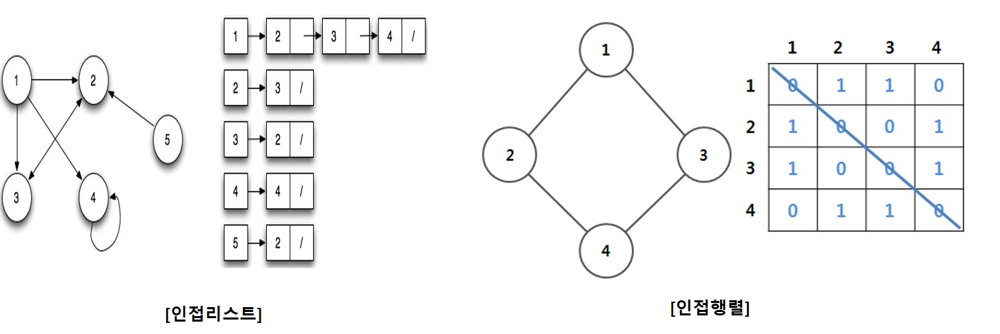

# Algorithm
## ● 깊이 우선 탐색(DFS)  
### 1. 정의 
- 어떤 정점과 연결된 다른 정점으로 파고 들어 탐색하는 방법 
- 루트 노드에서 시작하여 다음 분기로 넘어가기전 해당 분기를 탐색하는 방법 
- 어떤 정점에서 시작하여 연결된 다른 정점을 계속 파고 들어가 탐색 한 후,  연결된 정점이 없으면 다시 돌아와 다른 연결된 정점을 파고 들어 모든 정점를 탐색하는 방법 

### 2. 특징
* 스택(Stack)과 그래프(Graph) 자료구조를 사용함. 
&nbsp;&nbsp;&nbsp; - 그래프(Graph) : 노드(N, node)와 그 노드를 연결하는 간선(E, edge)를 하나로 모아 놓은 자료구조 
&nbsp;&nbsp;&nbsp; - 스택(Stack) : LIFO(Last In First Out)형식의 자료 구조. 가장 최근에 스택에 추가한 항목이 가장 먼저 나옴.  
&nbsp;&nbsp;&nbsp;&nbsp;&nbsp;&nbsp;깊이 우선 탐색(DFS)에서는 정점에 연결된 방문할 정점들을 스택에 쌓아 두어, 우선 순위대로 방문하기 위해 씀 
* 각 정점의 인접관계를 나타내기 위해 인접리스트(Adjacency List), 인접행렬(Adjacency Matrix)로 표현함

1. <a href="#" target="_blank">[문제 바로가기]</a> BFS_example.cpp
2. <a href="#" target="_blank">[문제 바로가기]</a> DFS_example.cpp
3. <a href="https://www.acmicpc.net/problem/9663" target="_blank">[문제 바로가기]</a> backtracking_example.cpp
4. <a href="https://www.acmicpc.net/problem/9663" target="_blank">[문제 바로가기]</a> backtracking_example1.cpp
5. <a href="https://www.acmicpc.net/problem/1003" target="_blank">[문제 바로가기]</a> baekjoon_1003.cpp
6. <a href="https://www.acmicpc.net/problem/1094" target="_blank">[문제 바로가기]</a> baekjoon_1094.cpp
7. <a href="https://www.acmicpc.net/problem/1904" target="_blank">[문제 바로가기]</a> baekjoon_1904.cpp
8. <a href="https://www.acmicpc.net/problem/1932" target="_blank">[문제 바로가기]</a> baekjoon_1932.cpp
9. <a href="https://www.acmicpc.net/problem/2455" target="_blank">[문제 바로가기]</a> baekjoon_2455.cpp
10. <a href="https://www.acmicpc.net/problem/2606" target="_blank">[문제 바로가기]</a> baekjoon_2606.cpp 
11. <a href="https://www.acmicpc.net/problem/2667" target="_blank">[문제 바로가기]</a> baekjoon_2667.cpp
12. <a href="https://www.acmicpc.net/problem/2748" target="_blank">[문제 바로가기]</a> baekjoon_2748.cpp
13. <a href="https://www.acmicpc.net/problem/7576" target="_blank">[문제 바로가기]</a> baekjoon_7576.cpp
14. <a href="https://www.acmicpc.net/problem/14502" target="_blank">[문제 바로가기]</a> baekjoon_14502.cpp 
15. <a href="https://www.acmicpc.net/problem/14890" target="_blank">[문제 바로가기]</a> baekjoon_14890.cpp
16. <a href="https://www.acmicpc.net/problem/17779" target="_blank">[문제 바로가기]</a> baekjoon_17779.cpp
17. <a href="https://www.acmicpc.net/problem/2270" target="_blank">[문제 바로가기]</a> baekjoon_2270.cpp
18. <a href="https://www.acmicpc.net/problem/15684" target="_blank">[문제 바로가기]</a> baekjoon_15684.cpp
19. <a href="https://www.acmicpc.net/problem/12865" target="_blank">[문제 바로가기]</a> baekjoon_12865.cpp 
20. <a href="https://www.acmicpc.net/problem/1463" target="_blank">[문제 바로가기]</a> baekjoon_1463.cpp
21. <a href="https://www.acmicpc.net/problem/13458" target="_blank">[문제 바로가기]</a> baekjoon_13458.cpp

